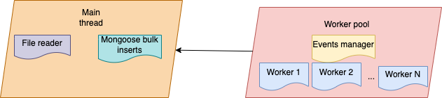

# Sirene Invader

This Node.js reads and store in a database large files in a time efficient manner.

## Prerequisites

- [PM2](https://pm2.keymetrics.io/docs/usage/quick-start/): `npm i -g pm2`
- [MongoDB](https://docs.mongodb.com/manual/installation/)

## Getting started

```shell
yarn # or npm install
pm2 start ecosystem.config.js # you can run `yarn start` as well
```

## Features

- Thread pool + task queue to share work between workers
- Use Readable Streams
- Efficient write in bulk in MongoDB
- mongoose is the only dependency
- `Ctrl + P` to pause the process and `Ctrl + R` to resume the process

## Architecture



## Benchmark

CSV file with 31 957 996 lines: `5:43:193 (m:ss:mmm)`
